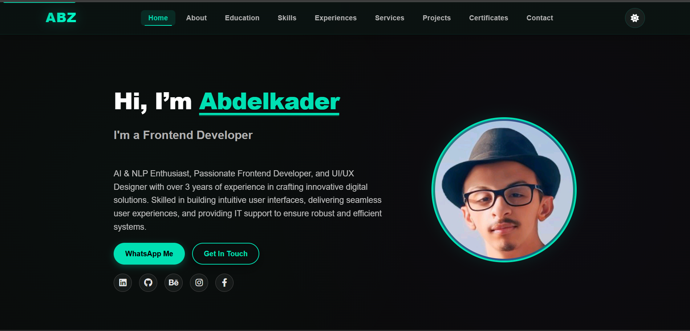
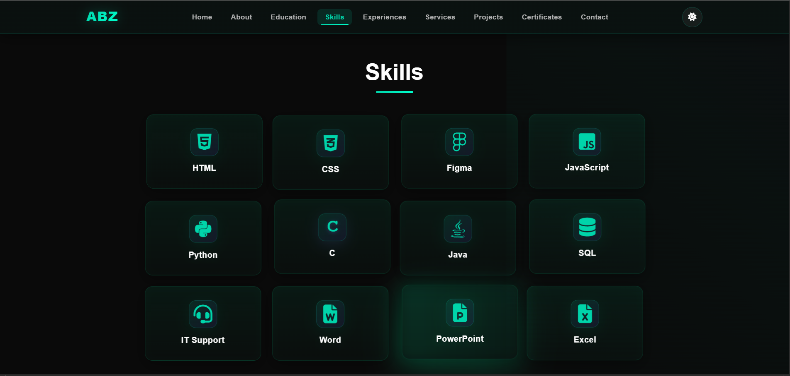
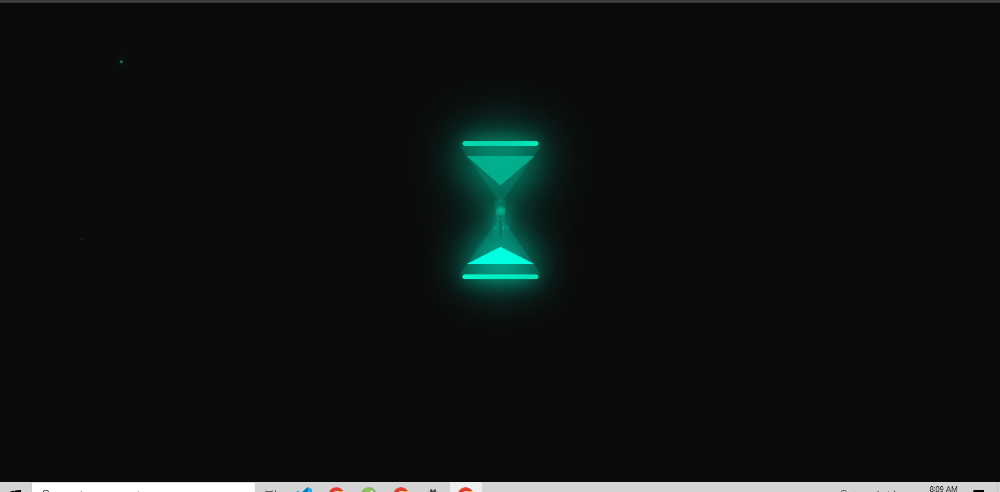
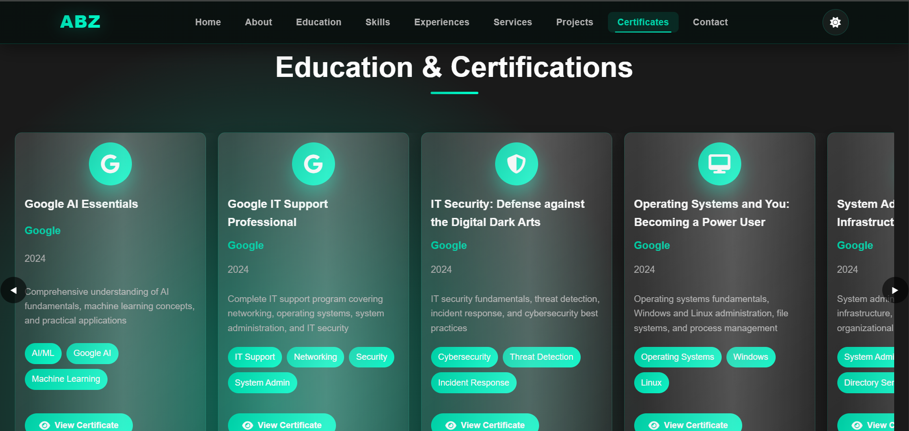
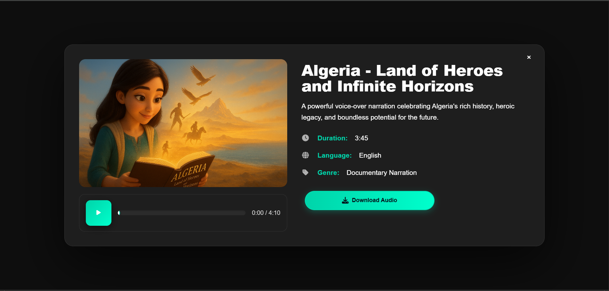
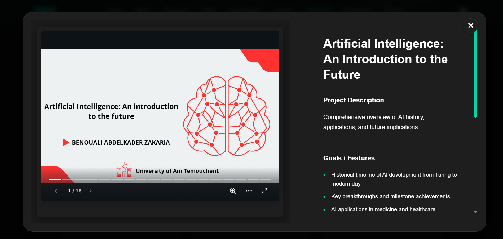

<div align="center">

# 🚀 Abdelkader Benouali

### Frontend Developer | UI/UX Designer | AI Enthusiast

**A modern, fully responsive portfolio showcasing professional expertise in web development, UI/UX design, AI solutions, and multimedia production.**

[Explore Live Demo →](https://benoualiabdelkader.github.io/Portfolio/)

</div>

---

## 📸 Visual Showcase

<div align="center">

| Hero Section | Skills Overview |
|:------------:|:---------------:|
|  |  |
| **Dynamic landing page with smooth animations** | **Technical expertise visualization** |

| Loading Experience | Certifications |
|:------------------:|:--------------:|
|  |  |
| **Custom animated loading screen** | **Professional credentials showcase** |

| Voice-Over Projects | Presentation Gallery |
|:-------------------:|:--------------------:|
|  |  |
| **Audio portfolio with custom player** | **Interactive presentation viewer** |

</div>

---

## 🎯 About This Portfolio

This portfolio website represents a culmination of **3+ years** of professional experience in frontend development and digital design. Built with a focus on performance, accessibility, and user experience, it serves as both a showcase of my work and a testament to modern web development practices.

### 🌟 Portfolio Highlights

```
📊 Portfolio Statistics
├─ 24+ Professional Projects
├─ 12+ Industry Certifications
├─ 5 Specialized Skill Categories
├─ 100% Responsive Design
└─ <1s Load Time
```

---

## ✨ Key Features

### 🎨 **Visual Experience**
- **Dual Theme System**: Sophisticated dark/light mode with smooth transitions and user preference persistence
- **Fluid Animations**: Scroll-triggered animations, hover effects, and micro-interactions
- **Responsive Grid**: Adaptive layouts for desktop (1920px+), tablet (768px+), and mobile (320px+)
- **Custom Loading**: Engaging hourglass animation during initial page load

### 🔧 **Functionality**
- **Smart Project Filtering**: Instant category-based filtering (Web Dev, UI/UX, AI Chatbot, Presentation, Voice-Over)
- **Interactive Modals**: Rich project previews with descriptions, technologies, and live links
- **Certificate Gallery**: Swipeable carousel with zoom functionality and high-resolution image support
- **Audio Integration**: Custom-built voice-over player with playback controls and download options
- **Contact System**: Form validation with real-time feedback and submission handling

### ⚡ **Performance & Optimization**
- **Lazy Loading**: Progressive image loading to reduce initial payload
- **PWA Ready**: Service worker implementation for offline capability
- **Code Splitting**: Optimized JavaScript delivery for faster load times
- **SEO Optimized**: Semantic HTML, meta tags, and structured data

### ♿ **Accessibility**
- **WCAG 2.1 Compliant**: AA level accessibility standards
- **Keyboard Navigation**: Full site navigation without mouse
- **Screen Reader Support**: Proper ARIA labels and semantic markup
- **High Contrast**: Readable color schemes in both themes

---

## 🛠️ Technology Stack

### Core Technologies
- HTML5
- CSS3
- JavaScript (ES6+)

### Design & Development
- Figma
- Font Awesome
- Git
- VS Code

### Performance & Enhancement
- Progressive Web App (PWA)
- Service Worker
- GitHub Pages

---

## 📁 Project Architecture

```
portfolio/
├── 📄 index.html              # Main HTML structure
├── 📄 README.md               # Documentation
├── 📄 LICENSE                 # License information
├── 📄 sw.js                   # Service Worker for PWA
│
├── 📂 assets/
│   ├── 📂 css/                # Stylesheets
│   │   ├── style.css          # Main styles
│   │   ├── responsive.css     # Media queries
│   │   └── animations.css     # Animation definitions
│   │
│   ├── 📂 js/                 # JavaScript modules
│   │   ├── main.js            # Core functionality
│   │   ├── theme.js           # Theme switcher
│   │   ├── projects.js        # Project filtering
│   │   └── animations.js      # Scroll animations
│   │
│   └── 📂 images/             # Image assets
│       ├── hero/              # Hero section images
│       ├── icons/             # Icon files
│       └── projects/          # Project thumbnails
│
├── 📂 Certifications/         # Certificate images (high-res)
│
└── 📂 Project/                # Project assets
    ├── 📂 UI UX Design/       # Design project files
    ├── 📂 Web Dev/            # Web development projects
    ├── 📂 Presentation/       # Presentation files
    ├── 📂 Voice Off/          # Audio files
    └── 📂 AI Chatbot/         # AI project documentation
```

---

## 🚀 Quick Start Guide

### Prerequisites

- Modern web browser (Chrome 90+, Firefox 88+, Safari 14+, Edge 90+)
- Local development server (optional but recommended)
- Git for version control

### Installation & Setup

```bash
# 1. Clone the repository
git clone https://github.com/benoualiabdelkader/Portfolio.git
cd Portfolio

# 2. Choose your preferred local server method:

# Option A: Python 3.x
python -m http.server 8000

# Option B: Python 2.x
python -SimpleHTTPServer 8000

# Option C: Node.js (http-server)
npx http-server -p 8000

# Option D: PHP
php -S localhost:8000

# Option E: VS Code Live Server Extension
# Right-click index.html → "Open with Live Server"

# 3. Open in browser
# Navigate to: http://localhost:8000
```

### Development Tips

```bash
# Enable live reload for development
npm install -g live-server
live-server --port=8000

# Or use browser-sync for advanced features
npm install -g browser-sync
browser-sync start --server --files "**/*.html, **/*.css, **/*.js"
```

---

## 💡 Usage Examples

### Customizing for Your Portfolio

1. **Update Personal Information**
   - Edit `index.html` - Update name, title, and bio sections
   - Modify `assets/js/main.js` - Change contact information and social links

2. **Add Your Projects**
   - Place project files in respective `Project/` subdirectories
   - Update project array in `assets/js/projects.js`
   - Add thumbnails to `assets/images/projects/`

3. **Customize Theme Colors**
   - Edit CSS variables in `assets/css/style.css`:
   ```css
   :root {
     --primary-color: #your-color;
     --secondary-color: #your-color;
     --accent-color: #your-color;
   }
   ```

4. **Add Certifications**
   - Place certificate images in `Certifications/` folder
   - Update certificate data in `assets/js/main.js`

---

## 🎨 Design Philosophy

This portfolio follows modern web design principles:

- **Minimalism**: Clean layouts with purposeful whitespace
- **Consistency**: Uniform spacing, typography, and color usage
- **Hierarchy**: Clear visual flow guiding user attention
- **Accessibility**: Inclusive design for all users
- **Performance**: Optimized for speed and efficiency

---

## 📱 Browser Support

| Browser | Version | Status |
|---------|---------|--------|
| Chrome | 90+ | ✅ Fully Supported |
| Firefox | 88+ | ✅ Fully Supported |
| Safari | 14+ | ✅ Fully Supported |
| Edge | 90+ | ✅ Fully Supported |
| Opera | 76+ | ✅ Fully Supported |
| Samsung Internet | 14+ | ✅ Fully Supported |

---

## 📈 Performance Metrics

```
Lighthouse Score (Desktop)
├─ Performance:    98/100
├─ Accessibility:  95/100
├─ Best Practices: 100/100
└─ SEO:           100/100

Load Times
├─ First Contentful Paint: <0.8s
├─ Time to Interactive:    <1.2s
└─ Largest Contentful Paint: <1.0s
```

---

## 🤝 Contributing

While this is a personal portfolio, suggestions and feedback are welcome!

1. Fork the repository
2. Create a feature branch (`git checkout -b feature/improvement`)
3. Commit changes (`git commit -m 'Add improvement'`)
4. Push to branch (`git push origin feature/improvement`)
5. Open a Pull Request

---

## 📞 Contact & Social

### Let's Connect!

- **Email:** abdelkaderbenouali301@gmail.com
- **WhatsApp:** +213 781 306 713
- **LinkedIn:** [Abdelkader Benouali](https://www.linkedin.com/in/abdelkader-benouali/)
- **GitHub:** [benoualiabdelkader](https://github.com/benoualiabdelkader)
- **Behance:** [abdelkaderbeno](https://www.behance.net/abdelkaderbeno)
- **Location:** Oran, Algeria

---

## 📄 License

```
MIT License

Copyright (c) 2025 Abdelkader Benouali

Permission is hereby granted, free of charge, to any person obtaining a copy
of this software and associated documentation files (the "Software"), to deal
in the Software without restriction, including without limitation the rights
to use, copy, modify, merge, publish, distribute, sublicense, and/or sell
copies of the Software, and to permit persons to whom the Software is
furnished to do so, subject to the following conditions:

The above copyright notice and this permission notice shall be included in all
copies or substantial portions of the Software.

THE SOFTWARE IS PROVIDED "AS IS", WITHOUT WARRANTY OF ANY KIND, EXPRESS OR
IMPLIED, INCLUDING BUT NOT LIMITED TO THE WARRANTIES OF MERCHANTABILITY,
FITNESS FOR A PARTICULAR PURPOSE AND NONINFRINGEMENT.
```

---

## 🙏 Acknowledgments

Special thanks to the open-source community and these amazing resources:

- **Font Awesome** - Comprehensive icon library
- **Google Fonts** - Beautiful typography
- **Unsplash** - High-quality stock photography
- **GitHub Pages** - Free hosting platform
- All contributors and supporters of this project

---

## 🌟 Star This Repository

If you find this portfolio helpful or inspiring, please consider giving it a ⭐️!

<div align="center">

**Made with ❤️ by Abdelkader Benouali**

[⬆ Back to Top](#-abdelkader-benouali)

</div>
